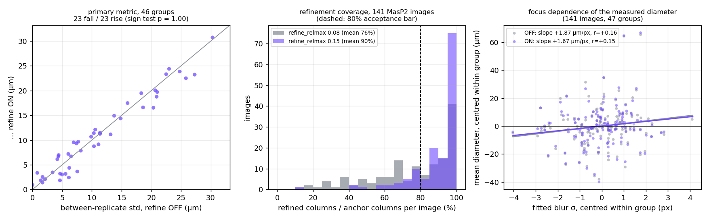

# Study 01 — ESF edge consistency: does erf edge refinement make replicates agree?

Labbook: `docs/labbooks/01_esf_edge_consistency.md`
Feature: `docs/features/03_esf_edge_refinement.md`
Design spec: `docs/superpowers/specs/2026-08-03-esf-edge-refinement-design.md`
Experiment date: 2026-08-03 (milestone M5)

**Headline:** the erf refinement works as an image-processing stage — it now
refines 90% of anchor columns and its fitted blur widths match the ones the
study measured by hand — but it does **not** improve replicate-to-replicate
diameter consistency on MasP2. The between-replicate spread falls in 23 of 46
groups and rises in the other 23 (sign test p = 1.00). The study's hypothesis
is **not supported on this dataset**, and the reason is visible in the data:
the replicates within a group do not show the same fibre thickness to begin
with (median spread of replicate medians 22.9%), so the metric's noise floor
(~9–11 µm) is an order of magnitude larger than the edge-placement effect the
refinement can remove (~1–3 µm).

---

## 1. Introduction

The optical setup blurs the air/silk boundary into an S-shaped ramp of width
σ ≈ 5–15 px. `edges.py` places each boundary where the desaturation z-map `D`
first crosses a fixed low level, `base + min(edge_z, edge_frac·A)`. The
distance from that crossing to the true step depends on σ, so the measured
diameter carries a focus-dependent bias — measured at +2.3 / −3.4 / +3.4 px
**per side** on three MasP2 images in the 2026-08-03 pilot.

For a symmetric PSF the 50% midpoint of the blurred profile sits exactly on
the true step, whatever σ is (the knife-edge principle). The `refine` stage
(landed 2026-08-03, Tasks 1–4) refits each wall, in blocks of 16 columns, as a
Gaussian-blurred step

    D(t) = a + (b − a)·½·[1 + erf((t − t₀)/(σ√2))]

and shifts the boundary to the fitted midpoint `t₀`. Blocks whose fit fails a
quality gate keep the legacy edge.

The hypothesis under test:

> Moving the boundary to the erf midpoint removes the focus-dependent
> edge-placement bias, measurably reducing replicate-to-replicate diameter
> spread on MasP2 versus the fixed-threshold edge.

This report is the A/B experiment (M5) that answers it.

## 2. Method

### 2.1 Dataset

`/Users/stan/Documents/UOM/spins/Images MasP2` (read-only), 144 JPEGs. 141 of
them parse into **47 groups × 3 replicates**: `3_1`–`3_5`, `4_2`–`4_8`,
`7_1`–`7_10`, `8_1`–`8_10`, `9_5`–`9_9`, `10_1`–`10_10`. Three files
(`teste`, `teste2`, `teste3`) have no group/replicate in their names; they are
measured but excluded from all group statistics.

By the project's locked assumption the three replicates of a group are the
same fibre segment re-photographed, so their diameters should agree.

### 2.2 Runs

Both arms use the identical pipeline and identical CONFIG apart from the
refinement switch, and both were run with the **final** tuned defaults
(`refine_relmax = 0.15`, see §3.1):

```
uv run python -m fibrecv.run_measure --root "/Users/stan/Documents/UOM/spins/Images MasP2" \
    --all --jobs 6 --no-refine --out fibrecv_output/ab_refine_off
uv run python -m fibrecv.run_measure --root "/Users/stan/Documents/UOM/spins/Images MasP2" \
    --all --jobs 6 --refine    --out fibrecv_output/ab_refine_on
uv run python -m fibrecv.run_aggregate --out fibrecv_output/ab_refine_off --all
uv run python -m fibrecv.run_aggregate --out fibrecv_output/ab_refine_on  --all
```

A third arm was run at the **as-landed** gate (`refine_relmax = 0.08`) into
`fibrecv_output/ab_refine_on_rel008`, as the before-picture of the tuning.

All three arms: 144/144 images measured, 0 errors, 9 low-confidence. Wall
time at `--jobs 6`: 1 min 56 s off, 2 min 18 s on — refinement costs ≈ 22 s
over 144 images.

### 2.3 Metrics

- **Primary** — within-group between-replicate standard deviation (ddof = 1)
  of the **per-image mean diameter in µm**, computed per group, off vs on. A
  replicate enters only if it is usable in **both** arms (no `band_mismatch`,
  QC coverage ≥ 0.5), so the two arms always compare the same replicate set.
  46 of 47 groups qualify; group `7_7` is dropped because two of its three
  replicates are `band_mismatch` in both arms.
- **Secondary** — `run_aggregate`'s pooled pointwise between-replicate std
  (registration-aware); detrended along-fibre noise `std(raw − smooth)`;
  refinement coverage (refined columns / anchor columns); fitted σ; QC flag
  counts.
- **Mechanism check** — within each group, the correlation between the
  per-image mean diameter and the image's fitted blur σ. Since a group is
  nominally one fibre, any such correlation *is* the focus-dependent bias the
  refinement claims to remove; it should be weaker with refinement on.

### 2.4 Acceptance criteria (from the design spec)

1. The primary metric falls in a clear majority of groups.
2. It rises in no group by more than that group's old between-replicate noise.
3. Refinement coverage ≥ ~80% of valid columns on typical images.

## 3. Results



*Left: primary metric per group, off vs on. Middle: refinement coverage before
and after the gate tuning. Right: the focus dependence of the measured
diameter, within-group centred.*

### 3.1 Tuning the residual gate

At the as-landed gate (`refine_relmax = 0.08`) refinement covered only
**76.4%** of anchor columns on average (median image 81.9%; 15.6% of images
below 50%), under the 80% acceptance bar. The single-image pilot had already
seen this on `masp2 10_1_1.jpg` (65.3% top, 23.1% bottom).

The plan's first guess was that 16-column blocks are noisier than the pilot's
64-column blocks. **That is not the cause.** On a 12-image probe, widening the
block barely moved coverage (mean of both walls at `relmax = 0.08`: block 16 →
66.9%, block 32 → 70.3%, block 64 → 68.0%). The residual is dominated by
*systematic model mismatch* — the specular core stripe inside the fit window
and shadow ramps outside it — which averaging more columns cannot remove.

Raising the residual gate, the sanctioned first knob, does work. Coverage over
all 141 images (mean of the two walls per image):

| `refine_relmax` | top | bottom | both (mean) | both (median image) | images ≥ 80% |
|---|---|---|---|---|---|
| 0.08 (as landed) | 75.1% | 77.6% | 76.4% | 81.9% | 53.2% |
| 0.10 | 81.4% | 84.4% | 82.9% | 89.1% | 64.5% |
| 0.12 | 84.1% | 89.1% | 86.6% | 92.8% | 73.0% |
| **0.15 (adopted)** | **85.9%** | **93.2%** | **89.6%** | **95.7%** | **81.6%** |
| 0.20 | 87.1% | 95.0% | 91.0% | 96.6% | 85.1% |
| 0.25 | 87.3% | 95.9% | 91.6% | 96.6% | 86.5% |

Two things justify 0.15 rather than a tighter or looser value.

**What a looser gate costs.** On synthetic profiles (a clean erf plus a
specular bump or a shadow ramp of controlled amplitude), the fitted midpoint
error grows smoothly with the fit residual: a fit admitted at residual 0.08 is
within ~0.7 px of the true step, one admitted at 0.15 is within ~1.5 px. Both
are smaller than the 2.3–3.4 px per-side bias of the legacy edge the block
would otherwise fall back to — so admitting these fits is still the better of
the two options. That bound is now a regression test
(`tests/test_refine.py::test_contamination_the_residual_gate_admits_moves_the_midpoint_under_1_5_px`).

**The fits themselves do not move.** Across `relmax` 0.08 → 0.20 the per-block
fitted midpoints and σ stay put (e.g. `masp2 10_1_1` top wall: median offset
−5.64 → −5.03 px; σ 10.8 → 8.6 px), i.e. the extra blocks a looser gate admits
agree with the ones a tight gate already accepted. Beyond 0.15 the coverage
gain is ≤ 2 points for a doubling of the admitted midpoint error, so 0.15 is
the knee.

**A knob that was rejected.** Shrinking the inward window `refine_in_max`
(28 → 20 → 16 → 12 px) also lifts coverage (66.9 → 79.0 → 85.5 → 89.3% on the
12-image probe) by excluding the specular stripe — but it truncates the erf's
inner plateau, and the fit degrades with it: on `masp2 10_1_1` the median
fitted σ collapses 10.8 → 8.1 → 6.5 px and the bottom-wall median offset walks
+4.9 → +2.0 → +0.5 px. Higher coverage bought with biased fits is not a win,
so `refine_in_max` was left at 28.

**Change made:** `CONFIG.refine_relmax` 0.08 → **0.15** in
`src/fibrecv/config.py`. Two gate unit tests, which had encoded contamination
doses calibrated to the 0.08 threshold, were re-calibrated (the doses raised
so they are still rejected) and joined by the new midpoint-error-bound test
above. Suite: **124 passed**.

The tuning does **not** change the study's answer. Re-running the primary
metric at every gate value gives the same null result — improved groups out of
46: 21 (0.08), 23 (0.10), 23 (0.12), 23 (0.15), 22 (0.20), 22 (0.25); median
group std 9.004 µm off vs 9.31 / 9.51 / 9.49 / 9.44 / 9.39 / 9.39 µm on.

### 3.2 Refinement coverage and fit quality (tuned arm)

| quantity | mean | median image | p10 |
|---|---|---|---|
| top-wall coverage | 85.9% | 94.1% | 59.6% |
| bottom-wall coverage | 93.2% | 99.1% | 79.8% |
| both walls | 89.6% | 95.7% | — |

81.6% of the 141 images are at ≥ 80% coverage on both walls; only 2.8% fall
below 50%. **Acceptance criterion 3 is met.**

The fits look like the ones the pilot did by hand: per-image median fitted
σ = 8.53 px (p10 5.62, p90 12.26) against the pilot's 7.3–9.3 px medians and
5.5–14.7 px p10–p90. The median applied offset is 2.46 px per side (p10 1.03,
p90 4.78) — the same few-px correction the pilot predicted.

### 3.3 Primary metric: no improvement

Between-replicate std of the per-image mean diameter, 46 groups:

| | mean (µm) | median (µm) |
|---|---|---|
| refine OFF | 11.143 | 9.004 |
| refine ON | 10.851 | 9.435 |

- **23 of 46 groups improve, 23 worsen.** Exact sign test, two-sided
  **p = 1.000**.
- Median change +0.018 µm; median |change| 1.458 µm; worst fall −4.080 µm
  (`8_10`), worst rise +2.615 µm (`4_8`).
- Two groups rise by more than their own off-arm noise: `10_5`
  (0.005 → 0.915 µm) and `10_7` (0.804 → 3.358 µm). Both are 2-replicate
  groups with a near-zero baseline, so this is a fragile comparison, but by
  the letter of the criterion it is a failure.
- Robustness: the same statistic on the per-image **median** diameter gives
  25/46 improved (p = 0.659), mean 11.445 → 10.961 µm.
- Stratified: for the 33 groups with off-arm std ≥ 5 µm, 18/33 improve (mean
  14.37 → 13.81 µm); for the 13 quieter groups (< 5 µm), only 5/13 improve
  (mean 2.94 → **3.34** µm — refinement makes the already-consistent groups
  slightly *less* consistent).

Per-group table (µm; `rep_spread` = spread of the three replicate median
diameters as a fraction of their mean — a measure of how much the replicates
disagree about the fibre itself):

| group | n | mean Ø | OFF | ON | Δ | rep_spread |
|---|---|---|---|---|---|---|
| 3_1 | 3 | 87.86 | 10.323 | 11.390 | +1.067 | 25.3% |
| 3_2 | 3 | 94.97 | 1.677 | 1.397 | −0.281 | 5.7% |
| 3_3 | 3 | 36.25 | 4.620 | 1.835 | −2.785 | 22.5% |
| 3_4 | 3 | 46.59 | 20.997 | 19.706 | −1.291 | 92.6% |
| 3_5 | 3 | 60.03 | 24.795 | 23.855 | −0.940 | 80.4% |
| 4_2 | 3 | 72.73 | 9.871 | 10.676 | +0.805 | 20.3% |
| 4_3 | 3 | 61.85 | 8.136 | 7.848 | −0.288 | 23.8% |
| 4_4 | 3 | 70.13 | 22.996 | 24.400 | +1.405 | 87.9% |
| 4_5 | 3 | 64.63 | 18.611 | 16.589 | −2.023 | 65.4% |
| 4_6 | 3 | 62.54 | 6.126 | 2.422 | −3.704 | 19.0% |
| 4_7 | 3 | 62.29 | 6.192 | 4.371 | −1.821 | 19.1% |
| 4_8 | 3 | 42.01 | 6.928 | 9.542 | +2.615 | 35.1% |
| 7_1 | 3 | 51.99 | 7.529 | 3.633 | −3.896 | 17.8% |
| 7_2 | 3 | 62.28 | 16.002 | 17.476 | +1.473 | 47.9% |
| 7_3 | 3 | 77.68 | 1.683 | 2.533 | +0.849 | 4.6% |
| 7_4 | 3 | 45.64 | 4.395 | 6.959 | +2.564 | 19.7% |
| 7_5 | 3 | 67.02 | 2.120 | 2.082 | −0.038 | 4.9% |
| 7_6 | 3 | 51.37 | 11.372 | 11.493 | +0.120 | 50.8% |
| 7_8 | 3 | 94.58 | 10.561 | 12.117 | +1.556 | 22.2% |
| 7_9 | 3 | 81.46 | 5.559 | 3.154 | −2.405 | 11.0% |
| 7_10 | 3 | 102.63 | 7.707 | 9.657 | +1.950 | 16.8% |
| 8_1 | 3 | 97.29 | 3.376 | 3.451 | +0.075 | 5.0% |
| 8_2 | 3 | 99.78 | 14.852 | 14.372 | −0.479 | 36.9% |
| 8_3 | 3 | 89.55 | 18.316 | 19.478 | +1.162 | 40.9% |
| 8_4 | 3 | 86.13 | 20.898 | 18.754 | −2.144 | 50.3% |
| 8_5 | 2 | 100.91 | 13.147 | 11.148 | −1.999 | 17.2% |
| 8_6 | 3 | 66.41 | 20.656 | 20.060 | −0.596 | 66.5% |
| 8_7 | 2 | 83.39 | 4.978 | 3.031 | −1.947 | 9.0% |
| 8_8 | 3 | 67.58 | 30.312 | 30.739 | +0.427 | 81.8% |
| 8_9 | 3 | 80.15 | 6.028 | 7.183 | +1.155 | 11.8% |
| 8_10 | 3 | 62.34 | 27.305 | 23.226 | −4.080 | 82.6% |
| 9_5 | 3 | 105.74 | 4.180 | 6.135 | +1.955 | 10.2% |
| 9_6 | 3 | 73.07 | 20.349 | 16.529 | −3.819 | 49.4% |
| 9_7 | 3 | 118.74 | 22.507 | 23.316 | +0.809 | 6.9% |
| 9_8 | 3 | 57.98 | 6.486 | 6.697 | +0.210 | 25.9% |
| 9_9 | 2 | 84.19 | 1.403 | 1.831 | +0.428 | 8.8% |
| 10_1 | 3 | 68.74 | 25.830 | 22.496 | −3.334 | 84.9% |
| 10_2 | 2 | 83.13 | 7.398 | 9.328 | +1.930 | 12.2% |
| 10_3 | 3 | 94.98 | 11.110 | 9.142 | −1.968 | 25.6% |
| 10_4 | 3 | 90.58 | 4.360 | 6.724 | +2.364 | 9.8% |
| 10_5 | 2 | 91.12 | 0.005 | 0.915 | +0.911 | 0.6% |
| 10_6 | 3 | 94.75 | 13.744 | 14.917 | +1.174 | 23.3% |
| 10_7 | 2 | 47.20 | 0.804 | 3.358 | +2.554 | 5.8% |
| 10_8 | 3 | 81.77 | 10.345 | 8.745 | −1.600 | 26.3% |
| 10_9 | 3 | 71.87 | 11.359 | 11.247 | −0.111 | 29.0% |
| 10_10 | 3 | 56.95 | 4.643 | 3.202 | −1.442 | 36.0% |

Refinement does move the numbers — the per-image mean diameter changes by
−0.238 µm on average with a standard deviation of 3.301 µm (p10 −4.80, p90
+3.85, largest single change 8.04 µm). The changes are simply not *coherent
within a group*: they are as likely to push two replicates apart as together.

### 3.4 Why: the replicates disagree about the fibre, not about the edge

The metric's floor is set by the dataset, not by the estimator. Across the 46
groups the median spread of the three replicate median diameters is **22.9%**
of their mean, and 16 groups exceed 30%. Examples from the off arm:

| group | replicate medians (µm) |
|---|---|
| 3_5 | 33.2 / 58.9 / 79.2 |
| 8_8 | 57.1 / 45.2 / 100.5 |
| 10_10 | 43.7 / 49.8 / 62.4 |

Differences of 20–55 µm cannot be edge placement: the whole erf correction is
2.46 px ≈ 1.8 µm per side. Either the replicates are photographs of different
stretches of a strongly tapered fibre, or of different fibres. `run_aggregate`
agrees — its cross-correlation registration reports
`registration_uncertain = True` for 36 of 46 groups.

Restricting to the groups where the replicates *do* look like the same fibre
does not rescue the result:

| subset | n | OFF mean (µm) | ON mean (µm) | improved |
|---|---|---|---|---|
| replicate medians agree within 10% | 10 | 4.291 | 4.864 | 3/10 (p = 0.34) |
| replicate medians agree within 20% | 20 | 5.559 | 5.631 | 8/20 (p = 0.50) |
| registration certain in both arms | 10 | 11.494 (pooled pointwise) | 10.710 | 5/10 (p = 1.00) |

**Mechanism check.** Within a group, the measured diameter *does* rise with
the fitted blur width — the bias the study predicted is real and visible:
off-arm slope **+1.87 µm per px of σ** (r = +0.162, 141 images, within-group
centred). But turning refinement on only trims it to **+1.67 µm/px**
(r = +0.146) — an 11% reduction, where the point of the σ-invariant midpoint
was to remove it. So the correction is directionally right and far too small.
Two reasons are visible in the data: coverage is 90%, not 100%, so ~10% of
columns still carry the legacy edge; and the correction is applied to *both*
walls independently, where the residual chromatic/specular asymmetry between
the two walls (pilot: channel midpoints disagree by 2–8 px) re-injects
per-image scatter.

### 3.5 Secondary metrics

**Along-fibre noise got worse.** The detrended per-column noise
`std(raw − smooth)` rose from 0.681 µm (median image 0.342) to 0.846 µm
(median 0.491), improving in only 8 of 141 images. The block-wise fit plus
linear interpolation between block centres adds a ~16-px-scale ripple to the
profile that the legacy per-column edge does not have. This is a real cost of
the stage.

**Registration-aware spread.** `run_aggregate`'s pooled pointwise
between-replicate std over the overlap: off mean 13.733 µm (median 10.963),
on mean 13.377 µm (median 11.066); 24/46 groups improve (p = 0.883). Same
null result as the primary metric.

**QC is unharmed.** Both arms give identical `band_mismatch` (7),
`low_confidence` (9) and `coverage < 50%` (3) counts. Mean QC coverage rises
from 95.38% to 95.50%; valid columns 340,746 → 341,152 (+406). The
interpolation-seam risk flagged in the plan did not materialise — the
rolling-MAD outlier flag (`FLAG_ROLL_OUTLIER`) *fell* from 2,739 to 2,345
columns (−14%), and `FLAG_CENTER_DEV` was essentially unchanged
(12,478 → 12,466).

## 4. Acceptance verdict

| criterion | result | verdict |
|---|---|---|
| primary falls in a clear majority of groups | 23/46 (50%), sign test p = 1.000 | **FAIL** |
| rises in no group beyond its old noise | 2/46 groups (`10_5`, `10_7`) exceed it | **FAIL** |
| coverage ≥ ~80% of valid columns | mean 89.6%, median image 95.7%, 81.6% of images ≥ 80% | **PASS** |

**The feature is not accepted on its stated goal.** It is a working,
well-covered, correctly-behaving stage that does not deliver replicate
consistency on this dataset.

## 5. Discussion

**The hypothesis is not supported here, but it is not refuted either.** The
experiment as designed cannot resolve a 1–3 µm effect inside a 9–11 µm noise
floor. What the data actually rule out is that focus-dependent edge placement
is a *dominant* driver of replicate disagreement on MasP2 — it is not; it is
at most a minor term next to the fact that the three replicates of a group are
not measuring the same piece of fibre.

**What the study did establish.**

- The blurred-step model holds on real data at scale: 90% of anchor columns
  produce an accepted erf fit, with σ (median 8.53 px) matching the pilot's
  hand fits.
- The focus-dependent bias is real and now quantified on 141 images: the
  measured diameter grows **+1.87 µm per px of blur σ** within a group. With
  σ ranging p10–p90 over 5.6–12.3 px, that is a ~12 µm systematic swing
  attributable to focus alone — worth removing *if* the rest of the
  measurement chain were tight enough for it to matter.
- The erf midpoint removes only 11% of that dependence in its current form, so
  something else in the wall model (specular asymmetry between the two walls;
  the chromatic edge the pilot found) limits it.

**Recommended next steps**, in order of expected value:

1. **Fix the dataset question first.** Re-photograph a small set of fibres with
   a deliberate protocol — same segment, marked, three focus settings — so
   that the between-replicate metric measures the estimator rather than the
   sample. Without this, no edge algorithm can be validated on MasP2.
2. **Test the mechanism directly, not through replicates.** A focus sweep of
   one fixed fibre segment gives σ as the independent variable and diameter as
   the dependent one; the acceptance test becomes "the slope of diameter
   against σ goes to zero", which needs no replicate assumption.
3. Investigate the residual +1.67 µm/px: fit both walls jointly, and check
   whether the two walls' offsets are anti-correlated (which would cancel in
   the diameter) or correlated (which would not).
4. Reduce the along-fibre ripple the stage introduces — e.g. overlapping
   blocks or a smoothness prior on the offset field — before the stage is used
   for anything requiring per-column fidelity.

**Should the stage stay on by default?** On the evidence here it is close to
neutral for the batch numbers (mean between-replicate std 11.14 → 10.85 µm,
mean per-image diameter change −0.24 µm) but it costs along-fibre smoothness
and adds ~0.15 s/image. That call is left to the project owner; nothing in
this report requires flipping the default, and `--no-refine` reproduces the
old numbers bit-identically.

## 6. Limitations

- **The primary metric is confounded by the sample.** Replicate framing and
  genuine taper dominate it (median replicate spread 22.9%). Every conclusion
  about "no improvement" is a statement about effect size relative to that
  floor, not proof that the erf midpoint is wrong.
- **Partial coverage means a blended estimator.** At 89.6% coverage, ~10% of
  columns in the "on" arm still carry the legacy fixed-threshold edge, and
  low-coverage walls (p10: 59.6% top, 79.8% bottom) are substantially legacy.
  A per-image number from the on arm is a mixture of the two estimators, not a
  pure erf measurement — check `meta["refine"]["coverage_top"/"coverage_bot"]`
  before treating one as refined.
- **The looser residual gate admits mildly contaminated fits**, bounded at
  ~1.5 px of midpoint error (§3.1). That bound is measured on synthetic
  contamination, not on real specular rims.
- **Only 46 of 47 groups, and 4 of those have 2 replicates**, so several
  per-group std values rest on two points and are very noisy.
- **Absolute accuracy is untested** and remains out of scope — the edge is
  chromatic, and no known-diameter standard was measured.
- Sign tests treat groups as independent, which they are for different fibres
  but not necessarily across the `A_*` batches.

---

### Reproducing

Outputs live under `fibrecv_output/` (gitignored): `ab_refine_off`,
`ab_refine_on` (final defaults), `ab_refine_on_rel008` (as-landed gate). Each
holds `per_image/csv/*_profile.csv`, `per_image/diagnostics/*_meta.json`,
`summary/master_summary.csv` and `summary/run_config.json` (the full CONFIG
snapshot for that arm). The analysis scripts were ephemeral, per repo policy;
every number above is recomputable from those artifacts with the commands in
§2.2.
